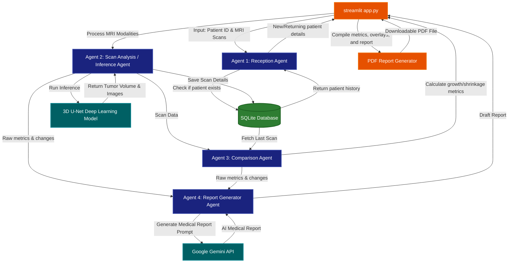

# 🧠 Brain Tumor Analysis System

An AI-powered 3D MRI segmentation, analysis, and clinical report generation system. It uses a **3D U-Net model** (trained on the BraTS 2020 dataset) and **Google Gemini AI** to automate brain tumor detection and generate detailed clinical reports.

---

## 🌟 Key Features

1. **AI-Powered 3D Segmentation:** Auto-detects and segments brain tumors into three regions:
   - 🔴 **NCR** (Necrotic Tumor Core)
   - 🟢 **ED** (Peritumoral Edema)
   - 🔵 **ET** (Enhancing Tumor)
2. **Multi-Modal Support:** Upload your own FLAIR, T1, T1CE, and T2 scans, or load directly from the BraTS dataset.
3. **Multi-Agent Collaboration:** A cooperative agent system acts like a team of doctors to register patients, run scan inference, compare historical data, and draft reports.
4. **Historical Comparison:** Automatically tracks tumor volume changes (growth/shrinkage) for returning patients.
5. **AI Neuro-Radiologist Reports:** Generates professional medical reports using Google's Gemini API.
6. **PDF Reports & Visualization:** View overlay images in 3D-like views and download a complete, clinical-style PDF report.

---

## 🚀 How to Run the Project

### 1. Prerequisites
Ensure you have Python installed (Python 3.8+ recommended).

### 2. Install Dependencies
Open your terminal inside the project directory and install the required libraries:
```bash
pip install -r requirements.txt
```

### 3. Configure Environment Variables
Create a file named `.env` in the root folder (this is already ignored by Git for security) and add:
```env
GEMINI_API_KEY=your_gemini_api_key_here
BRATS_DATASET_PATH=C:/path/to/your/brats_dataset  # (Optional)
```

### 4. Run the Streamlit Web Application
Launch the app with Streamlit:
```bash
streamlit run app.py
```
Open the local link (usually `http://localhost:8501`) in your browser to view the application!

---

## 🛠️ Project Structure

- `app.py`: The main Streamlit user interface.
- `agents.py`: Orchestrates the AI agents (Reception, Scan, Comparison, Report Generator).
- `model_inference.py`: Runs the 3D U-Net deep learning model inference.
- `database.py`: Handles patient registration and scan history using SQLite.
- `report_generator.py`: Generates the printable PDF reports with visualizations.
- `config.py`: Loads the configuration settings.

---

## 📐 System Architecture

Here is how the data flows through the different cooperative agents inside the system:


